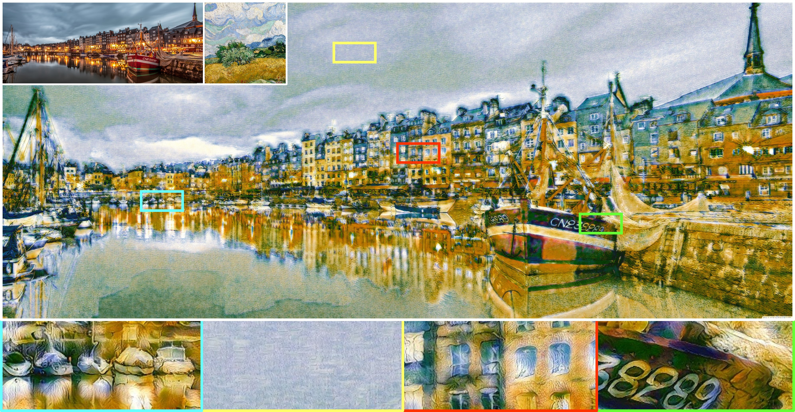
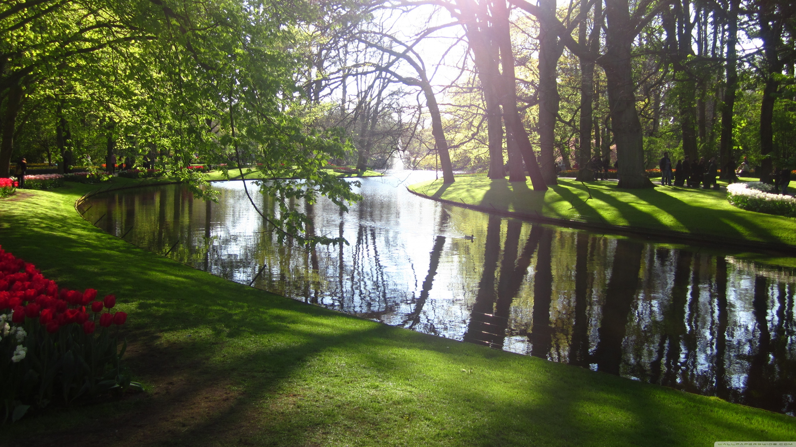

# Collaborative-Distillation
Official PyTorch code for our CVPR-20 poster paper "[Collaborative Distillation for Ultra-Resolution Universal Style Transfer](https://arxiv.org/abs/2003.08436)", where we propose a new knowledge distillation method to reduce VGG-19 filters, realizing the ultra-resolution universal style transfer on a single 12GB GPU. We focus on model compression instead of new stylization schemes. For stylization, our method builds upon [WCT](https://papers.nips.cc/paper/6642-universal-style-transfer-via-feature-transforms.pdf).

<center></center>
<center>One stylized sample of 10240 x 4096 pixels</center>

## Environment
- python==3.6.9
- pytorch==0.4.1 (please do not use 1.x versions, since we will need the `load_lua` feature)
- torchvision==0.2.1
- CUDA + cuDNN

## Test (style transfer)

**Step 1: Prepare images**
- Contents are placed in `PytorchWCT/content`, where ultra-res contents are placed in `PytorchWCT/content/UHD_content`. Same path setting for the styles. 
- Since the ultra-res images can be quite large, we only place two samples in this repo. For more ultra-res contents and styles presented in our paper, please download them from this [google drive](https://drive.google.com/drive/folders/12gGM0yszAVrcN6owf6P4XbVYgyLhW8Vf?usp=sharing).
> Image copyrights: We use the UHD images from [this wallpaper website](http://wallpaperswide.com/). All copyrights are attributed to them and thanks to them!

**Step 2: Prepare models**
- For original WCT: Download the unpruned [models](https://drive.google.com/file/d/0B8_MZ8a8aoSeWm9HSTdXNE9Eejg/view) (which are from the [official WCT implementation](https://github.com/Yijunmaverick/UniversalStyleTransfer)). Unzip and place them under `trained_models/original_wct_models`.
- For ultra-resolution WCT: We use our pruned VGG-19. The models are already in the `trained_models/wct_se_16x_new` (for encoders) and `trained_models/wct_se_16x_new_sd` (for decoders).

**Step 3: Stylization**

- Under the `PytorchWCT` folder, please run the following scripts. The stylized results will be saved in `PytorchWCT/stylized_results`.
```
# use original VGG-19, normal images
CUDA_VISIBLE_DEVICES=0 python WCT.py --debug --mode original

# use original VGG-19, ultra-res images
CUDA_VISIBLE_DEVICES=0 python WCT.py --debug --mode original --UHD

# use our pruned VGG-19, normal images
CUDA_VISIBLE_DEVICES=0 python WCT.py --debug --mode 16x

# use our pruned VGG-19, ultra-res images
CUDA_VISIBLE_DEVICES=0 python WCT.py --debug --mode 16x --UHD

# If your RAM cannot afford some large images, you can change the content and style size via '--content_size' and '--style_size'
CUDA_VISIBLE_DEVICES=0 python WCT.py --debug --mode 16x --UHD --content_size 3000 --style_size 2000
```

In default, the above scripts will test all possible content-style combinations (i.e., for 3 contents with 4 styles, there will be 3x4 stylzed results). If you only want to test a specific pair, say, content "green_park-wallpaper-3840x2160.jpg" with style "Vincent_2K.jpg",  you can use the option `--picked_content_mark` and `--picked_style_mark` to select specific pairs. E.g., the following will only choose the content whose name includes "green_park" and the style whose name includes "Vincent".
```
CUDA_VISIBLE_DEVICES=0 python WCT.py --debug --mode 16x --UHD --picked_content_mark green_park --picked_style_mark Vincent
```

## Train (model compressiom)

**Step 1: Prepare dataset**

Download the [MS-COCO 2014 training set](http://cocodataset.org/#download) and unzip it at path `data/COCO/train2014`.

**Step 2: Prepare models**

For training the SE (small encoder), we need the original decoder (big decoder or BD). We trained our own BD following the [WCT paper](https://papers.nips.cc/paper/6642-universal-style-transfer-via-feature-transforms.pdf). You can download them from [this google drive](https://drive.google.com/drive/folders/1qo2dv9bKJxS8xiThzp-PFe7ClHWS3Lhx?usp=sharing) and put them at path `trained_models/our_BD`.


**Step 3: Train the compressed encoders**

Under the root folder, run
```
CUDA_VISIBLE_DEVICES=0 python main.py --mode wct_se --pretrained_init --screen --stage 5 -p wct_se_stage5
CUDA_VISIBLE_DEVICES=0 python main.py --mode wct_se --pretrained_init --screen --stage 4 -p wct_se_stage4
CUDA_VISIBLE_DEVICES=0 python main.py --mode wct_se --pretrained_init --screen --stage 3 -p wct_se_stage3
CUDA_VISIBLE_DEVICES=0 python main.py --mode wct_se --pretrained_init --screen --stage 2 -p wct_se_stage2
CUDA_VISIBLE_DEVICES=0 python main.py --mode wct_se --pretrained_init --screen --stage 1 -p wct_se_stage1
```
- The log and trained models will be saved in a new-built project folder under `Experiments`.
- `--pretrained_init` is to indicate using base models for initialization, which are obtained by pruning the filters with the least L1-norms (see also [2017-ICLR-Filter Pruning](https://openreview.net/pdf?id=rJqFGTslg))

**Step 4: Train the corresponding decoders**

```
CUDA_VISIBLE_DEVICES=0 python main.py --mode wct_sd --pretrained_init --screen --lw_percep 0.01 --stage 5 -p wct_sd_stage5 --SE <SE path>
CUDA_VISIBLE_DEVICES=0 python main.py --mode wct_sd --pretrained_init --screen --lw_percep 0.01 --stage 4 -p wct_sd_stage4 --SE <SE path>
CUDA_VISIBLE_DEVICES=0 python main.py --mode wct_sd --pretrained_init --screen --lw_percep 0.01 --stage 3 -p wct_sd_stage3 --SE <SE path>
CUDA_VISIBLE_DEVICES=0 python main.py --mode wct_sd --pretrained_init --screen --lw_percep 0.01 --stage 2 -p wct_sd_stage2 --SE <SE path>
CUDA_VISIBLE_DEVICES=0 python main.py --mode wct_sd --pretrained_init --screen --lw_percep 0.01 --stage 1 -p wct_sd_stage1 --SE <SE path>
```
- `<SE path>` is to specify the small encoder model trained in Step 3. A path example for stage5 is `Experiments/*wct_se_stage5*/weights/*.pth`

## Results
<center></center>

<center></center>

<center></center>


### Acknowledgments
In this code we refer to the following implementations: [PytorchWCT](https://github.com/sunshineatnoon/PytorchWCT), [UniversalStyleTransfer](https://github.com/Yijunmaverick/UniversalStyleTransfer), [pytorch-AdaIN](https://github.com/naoto0804/pytorch-AdaIN), [AdaIN-style](https://github.com/xunhuang1995/AdaIN-style). Great thanks to them!

### Reference
Please cite this in your publication if our work helps your research. Should you have any questions, welcome to reach out to Huan Wang (wang.huan@northeastern.edu).

    @inproceedings{wang2020collaborative,
      Author = {Wang, Huan and Li, Yijun and Wang, Yuehai and Hu, Haoji and Yang, Ming-Hsuan},
      Title = {Collaborative Distillation for Ultra-Resolution Universal Style Transfer},
      Booktitle = {Proceedings of the IEEE Conference on Computer Vision and Pattern Recognition (CVPR)},
      Year = {2020}
    }
